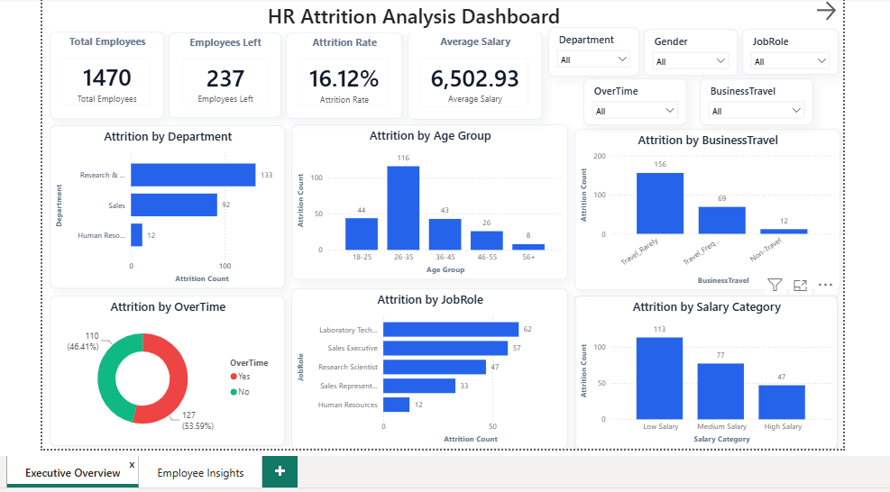
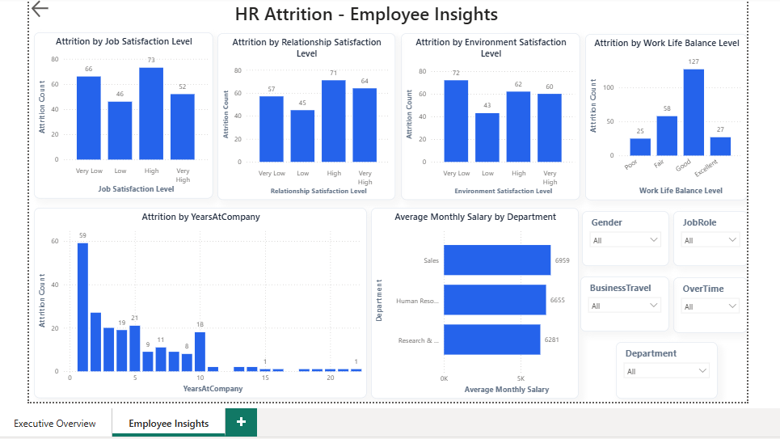

# 📊 HR Employee Attrition Analysis

## 📌 Project Overview

Employee attrition is one of the biggest challenges faced by organizations. Understanding why employees leave helps companies improve employee retention, reduce hiring costs, and build a better work environment.

This project analyzes the IBM HR Employee Attrition dataset using SQL, Python, and Power BI to identify the major factors contributing to employee attrition and present actionable business insights through an interactive dashboard.

---

## 🎯 Objectives

- Analyze employee attrition trends.
- Identify the key factors influencing employee turnover.
- Perform SQL-based business analysis.
- Conduct Exploratory Data Analysis (EDA) using Python.
- Build an interactive Power BI dashboard for HR decision-making.

---

## 🛠️ Tools & Technologies

- SQL (MySQL)
- Python
- Pandas
- Matplotlib
- Seaborn
- Google Colab
- Power BI
- DAX
- Git & GitHub

---

## 📂 Project Structure

```
HR-Attrition-Analysis
│
├── Dataset
│   └── hr_employee_attrition.csv
│
├── SQL
│   └── Sql_queries.sql
│
├── Python
│   └── HR_Attrition_EDA.ipynb
│
├── PowerBI
│   └── HR Attriton Analytics.pbix
│
├── Screenshots
│   ├── Executive_overview.png
│   └── Employee_insights.png
│
└── README.md
```

---

# 📊 Dataset Information

- Dataset: IBM HR Employee Attrition
- Total Employees: **1470**
- Total Features: **35**
- Target Variable: **Attrition**

---

# 🗄️ SQL Analysis

Performed business analysis using SQL by writing 40+ queries covering:

- Employee distribution
- Department Analysis
- Gender Analysis
- Age Analysis
- Overtime Analysis
- Business Travel Analysis
- Job Role Analysis
- Marital Status Analysis
- Education Analysis
- Salary Analysis
- Satisfaction Analysis
- Experience Analysis
- CASE Statements
- Subqueries
- Common Table Expressions (CTEs)
- Window Functions (RANK, DENSE_RANK, ROW_NUMBER, LAG)

---

# 🐍 Python Exploratory Data Analysis

Performed Exploratory Data Analysis (EDA) using Python.

Tasks included:

- Data Loading
- Data Cleaning
- Missing Value Analysis
- Duplicate Check
- Feature Engineering
- Correlation Analysis
- Data Visualization
- Business Insight Generation

Libraries Used

- Pandas
- Matplotlib
- Seaborn

---

# 📈 Power BI Dashboard

Created a two-page interactive HR Analytics dashboard.

### Executive Overview

Includes:

- Total Employees
- Employees Left
- Attrition Rate
- Average Monthly Salary
- Department-wise Attrition
- Age Group Analysis
- Job Role Analysis
- Business Travel Analysis
- Salary Category Analysis
- Interactive Filters

### Employee Insights

Includes:

- Job Satisfaction
- Environment Satisfaction
- Work-Life Balance
- Relationship Satisfaction
- Years at Company
- Average Salary by Department
- Interactive Filters

---

# 📸 Dashboard Preview

## Executive Overview



---

## Employee Insights



---

# 🔍 Key Business Insights

- Overall employee attrition rate is **16.12%**.
- Employees working overtime have an attrition rate of **30.53%**, almost three times higher than employees who do not work overtime.
- Employees aged **18–25** have the highest attrition rate (**35.77%**).
- Employees who travel frequently have significantly higher attrition than non-travel employees.
- Sales Representatives have the highest attrition among all job roles.
- Employees in the low salary category have the highest attrition rate.
- Job Level has the strongest positive correlation with Monthly Income.
- Research & Development has the largest workforce, while Sales experiences the highest employee turnover rate.

---

# 💼 Business Recommendations

- Reduce excessive overtime.
- Improve employee work-life balance.
- Strengthen onboarding and mentoring programs for younger employees.
- Review compensation strategies for lower salary groups.
- Focus retention efforts on high-risk job roles.
- Improve career growth opportunities and employee engagement.

---

# 🚀 Learning Outcomes

Through this project, I gained practical experience in:

- Writing business-focused SQL queries
- Exploratory Data Analysis (EDA)
- Data Cleaning
- Data Visualization
- Power BI Dashboard Development
- DAX Measures
- Business Insight Generation
- HR Analytics

---

# 👩‍💻 Author

**Sushma Sakry**

---

## ⭐ If you found this project useful, consider giving it a star!